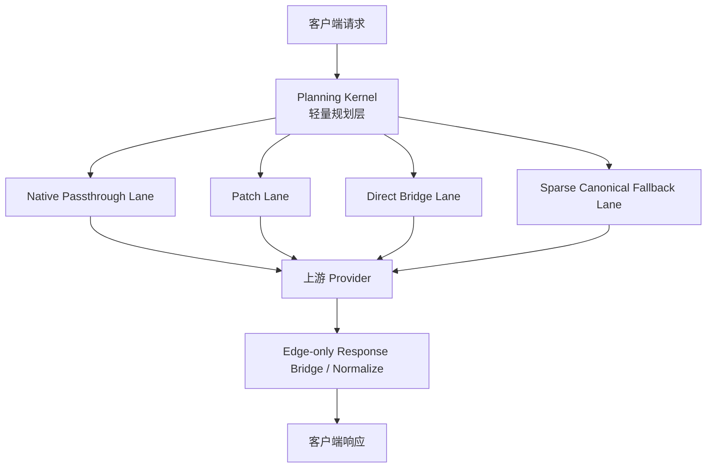

# Sub2API 兼顾性能与兼容性的兼容内核方案

> 状态：架构结论沉淀文档
> 更新时间：2026-04-25
> 适用范围：`Sub2API` 主框架后续兼容内核演进、Claude/Codex/Cherry 多客户端兼容、GPT/Claude/GLM/Kimi 多上游适配

---

## 1. 背景

当前项目已经具备较强的运行时能力：

- `Account / Group / Channel`
- 调度
- sticky session
- failover
- billing / quota
- Claude Code / Codex 深链路兼容经验

但在“任意客户端 -> 任意上游 AI”的目标下，现有架构仍有两个明显问题：

1. **兼容逻辑按 provider 分散**
   - `GatewayHandler`
   - `OpenAIGatewayHandler`
   - `CompatibleGatewayHandler`
   - 不同 service 内又叠加 patch / fallback / repair

2. **热点链路存在重桥接**
   - `Claude Code -> GPT -> /v1/messages`
   - 当前主路径偏向：
     - `Anthropic Messages -> OpenAI Responses -> Anthropic`
   - `Claude Code -> Kimi -> /v1/messages`
   - 当前存在：
     - native / relay / chat fallback / tool restore 多层叠加

这会同时影响：

- 首 token 时延
- SSE 流式稳定性
- 故障可观测性
- 新平台接入成本

---

## 2. 对比结论

### 2.1 当前 Sub2API

更准确的描述不是“客户端优先”，而是：

> **runtime-first / provider-aware / client-aware**

即：

1. 先按 `Group.Platform` / 上游平台分流
2. 再进入不同 handler / service
3. 再根据客户端协议、UA、header、body 做兼容修补

优点：

- 运行时能力强
- 调度能力强
- 现有主线稳定

不足：

- 兼容决策不统一
- 热路径和冷路径没有清晰区分
- 容易继续长成 patch/fallback 森林

### 2.2 New-API

更准确的描述是：

> **protocol-first / adapter-first / native-first**

即：

1. 先按请求协议归类
2. 再由 provider adapter 承接
3. bridge 主要发生在协议边界

优点：

- 兼容性更自然
- 新 provider 扩展更顺
- 某些链路能更早命中更短路径

不足：

- 不能直接替代 Sub2API 的运行时骨架
- 若整套照搬，会引入新的控制面和维护成本
- 胖接口 / 全量 canonical 化思路不适合直接并入当前项目

### 2.3 最终判断

最优方向不是二选一，而是：

> **Sub2API runtime 外壳**
> + **protocol-first 规划层**
> + **native/direct 执行层**
> + **edge-only bridge 工具层**

---

## 3. 总体目标

本项目后续兼容内核的最终目标：

> **任意客户端通过本平台，可接入任意上游 AI。**

阶段性解释：

- 客户端只是协议外壳，不应和具体模型深绑定
- 上游模型应尽量通过能力声明与 adapter 承接，而不是继续靠平台特判
- 不支持的能力必须返回**确定性 compatibility error**
- 支持的能力应优先走**最短可行路径**

---

## 4. 设计结论：不是“大一统中台”，而是“双层内核”

最终推荐架构：

> **轻量 Planning Kernel + Specialized Execution Lanes**

也就是：

1. **统一的是决策**
2. **不是所有数据流都必须统一 canonical**
3. **热路径必须特化**
4. **冷路径才进入 heavy bridge / sparse canonical**

---

## 5. 核心原则

### 5.1 Protocol-first 只用于规划层

协议优先不等于每个请求都先进统一中间层。

正确做法：

- 在请求开始时根据：
  - `client_profile`
  - `inbound_protocol`
  - `requested_model`
  - `provider_capability`
- 生成一次 `ExecutionPlan`

错误做法：

- 每个请求先完整 canonicalize
- 所有 SSE event 都统一转成中间事件再回写

### 5.2 Native-first

只要上游原生支持当前协议，就优先走原生路径。

优先级：

```text
native passthrough
> patch lane
> direct bridge
> sparse canonical fallback
> deterministic compatibility error
```

### 5.3 Bridge only on the edge

bridge 只在必要的协议边界发生：

- request edge
- response edge

不允许把 bridge 做成整条链的默认中台。

### 5.4 Hot path 与 cold path 分离

热路径只允许：

- 原生透传
- 极薄 patch
- 一次 direct bridge

冷路径才允许：

- buffered rebuild
- tool restore
- sparse canonical fallback

### 5.5 Fallback 必须确定化

fallback 不能再依赖大量运行时猜测。

要求：

- planning 阶段就给出：
  - `primary_route`
  - `fallback_chain`
- 运行中最多切换一次 lane
- 原因必须可观测：
  - unsupported
  - validation failure
  - deterministic incompatibility

---

## 6. 目标架构分层



### 6.1 Runtime Shell（保留）

继续保留 Sub2API 的运行时能力：

- `Account / Group / Channel`
- scheduler
- sticky session
- failover
- billing / quota
- usage / ops

### 6.2 Planning Kernel（新增）

职责：

- 识别 `client_profile`
- 识别 `inbound_protocol`
- 查 `provider_capability`
- 生成 `ExecutionPlan`

### 6.3 Execution Lanes（新增抽象）

职责：

- 真正执行请求
- 选择最短链路
- 避免重复转换

### 6.4 Bridge Utilities（抽取）

职责：

- request edge bridge
- response edge bridge
- stop_reason normalize
- usage normalize
- SSE transducer

---

## 7. Execution Lanes 设计

### 7.1 Lane 1：Native Passthrough

适用：

- `Codex -> OpenAI Responses`
- `Claude Code -> Anthropic Messages`
- `Cherry -> OpenAI Images`

特征：

- body 不做完整 typed decode
- SSE 不做重组
- 仅做：
  - auth
  - model mapping
  - headers
  - 计费 sidecar

### 7.2 Lane 2：Patch Lane

适用：

- `prompt_cache_key`
- `service_tier`
- `stream_options.include_usage`
- model rewrite
- 移除上游不支持字段

特征：

- 使用 `gjson/sjson`
- 不进入 `map[string]any`
- 不做整对象 `marshal/unmarshal`

### 7.3 Lane 3：Direct Bridge Lane

适用：

- `Claude Code -> GPT`
  - `Anthropic Messages -> ChatCompletions -> Anthropic`
- 其他单次桥接链路

特征：

- 只桥一次
- 不进 full canonical
- request/response 各在边界做一次转换

### 7.4 Lane 4：Sparse Canonical Fallback Lane

适用：

- 长尾 provider
- 复杂 tools / reasoning 混合
- tool call 被压平后的兜底修复
- 必须 buffered rebuild 的场景

特征：

- 只做 fallback
- 不进入默认主路径

---

## 8. 关键内部模型

### 8.1 RequestEnvelope（建议）

目的：

- 避免一个请求反复 decode 多次
- 浅解析先拿关键字段
- 深对象按需 lazy decode

建议结构示意：

```go
type RequestEnvelope struct {
    RawBody []byte
    Header  http.Header
    Path    string

    Model        string
    Stream       bool
    HasTools     bool
    HasReasoning bool

    anthropicReq *apicompat.AnthropicRequest
    responsesReq *apicompat.ResponsesRequest
    chatReq      *apicompat.ChatCompletionsRequest
}
```

### 8.2 CompatibilityExecutionPlan（建议）

建议结构示意：

```go
type CompatibilityExecutionPlan struct {
    ClientProfile   ClientProfile
    InboundProtocol InboundProtocol
    RequestedModel  string
    UpstreamModel   string

    PrimaryLane   CompatibilityRoute
    FallbackChain []CompatibilityRoute

    BodyMode    BodyRewriteMode
    StreamMode  StreamRewriteMode
    ErrorMode   ErrorPolicy
    Transport   UpstreamTransport
}
```

### 8.3 Provider Capability（继续强化）

继续沿用并升级：

- `SupportsMessages`
- `SupportsChat`
- `SupportsResponses`
- `SupportsImages`
- `SupportsTools`
- `SupportsReasoning`
- `SupportsPreviousResp`
- `SupportsWS`
- `SupportsLateUsage`
- fallback policy

要求：

> capability 不再只是日志字段，而是真正的决策输入。

---

## 9. 热路径落位建议

### 9.1 Claude Code -> GPT

当前痛点：

- 当前主链过重
- 已有 benchmark 证明慢于 New-API

建议主链：

```text
Anthropic Messages
-> OpenAI ChatCompletions
-> Anthropic
```

建议 fallback：

```text
Anthropic Messages
-> OpenAI Responses
-> Anthropic
```

规则：

- 默认优先走 `chat` fast path
- 只有遇到必须依赖 Responses 特性的语义时才退回 Responses bridge

### 9.2 Claude Code -> Kimi / Moonshot

建议顺序：

```text
messages native
-> endpoint relay
-> chat fallback
-> tool restore only fallback
```

规则：

- `tool_restore` 明确只是兜底
- 不能继续承担主成功路径

### 9.3 Codex

建议：

- 尽量保持原生 `responses` / `ws`
- 只做最薄 patch
- 避免被拉进通用 canonical lane

### 9.4 Cherry Studio

建议：

- `chat/completions` 走 native/openai-compatible lane
- `images` 走原生 shape normalize
- 不进入统一重 bridge

---

## 10. 明确不做的事情

当前方向明确**不做**：

1. 不把 Sub2API 改造成 New-API 的 channel-center 架构
2. 不引入一个默认全量 canonical 数据面
3. 不让所有请求都经过统一 SSE 重组
4. 不为了“形式统一”牺牲首 token 性能
5. 不把 `tool restore`、`文本修复` 这类末级兜底升级成主路径

---

## 11. 迁移顺序

### Phase 0：轻内核落地，不改外部行为

新增：

- `compatibility_kernel.go`
- `compatibility_execution_plan.go`
- `provider_adapter.go`
- `stream_normalizer.go`
- `protocol_bridge.go`

先完成：

- `RequestEnvelope`
- `ExecutionPlan`
- capability lookup
- plan logging

### Phase 1：先打两条最高价值热路径

1. `Claude Code -> GPT`
   - 从 Responses bridge 默认主路径切换为 Chat fast path

2. `Claude Code -> Kimi`
   - 固化 native-first
   - 将 restore 降为 fallback

### Phase 2：抽公共 utility

抽出：

- auth/header normalize
- body patch ops
- SSE transducer
- stop_reason normalize
- late usage parse
- upstream error normalize
- HTML 假成功识别

### Phase 3：legacy handler 退化成 façade

未来：

- `GatewayHandler`
- `OpenAIGatewayHandler`
- `CompatibleGatewayHandler`

主要职责只保留：

- parse inbound
- fill compatibility context
- invoke kernel
- write response

### Phase 4：迁移剩余客户端

顺序建议：

1. Codex `/responses`
2. Cherry `/chat/completions`
3. Cherry images
4. GLM / 其他 compatible providers

---

## 12. 验收标准

### 性能

- 热路径尽量：
  - 0 次转换
  - 或 1 次 direct bridge
- `Claude Code -> GPT -> /v1/messages`
  - 相比当前重 Responses bridge 明显下降首 token 时延

### 兼容性

- 支持的能力稳定可运行
- 不支持能力返回确定性 compatibility error
- fallback 路径可观测

### 可维护性

- 新增 provider 先填 capability
- 再实现 adapter / lane
- 不再直接扩散到多个 handler/service 拼 patch

---

## 13. 最终结论

本项目后续兼容内核演进方向，正式定为：

> **Runtime-first Shell**
> + **Protocol-first Planning**
> + **Native-first Execution**
> + **Edge-only Bridge**
> + **Sparse Canonical Fallback**

一句话概括：

> **兼容内核负责“选哪条路”，快路径负责“怎么最快跑完这条路”。**

这套架构是当前阶段在：

- 性能
- 兼容性
- 可扩展性
- 对现有 Sub2API 的复用度

之间的最优平衡点。
